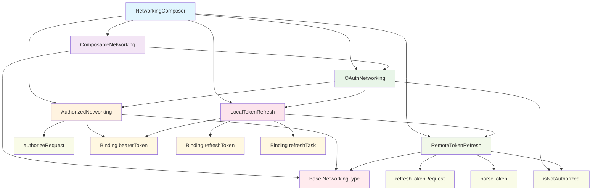

# Networking as a Source of Truth: The Composable Networking
NOTE: This is (NOT) yet another networking library.

### Composability

- Achieving composability is easy: **Eliminate state ownership**
- Using composable components we can still create a class that owns and hides state when needed. **The opposite is much harder**
- Composable components can integrate seamlessly into the SwiftUI lifecycle. **Classes require "observability" boilerplate and manual lifecycle management**

### Complete diagram of composable networking with refresh token logic

### Full implementation
[Composable Networking](https://gist.github.com/sisoje/2e5e5f00b4f310d06245314b2b560376)

